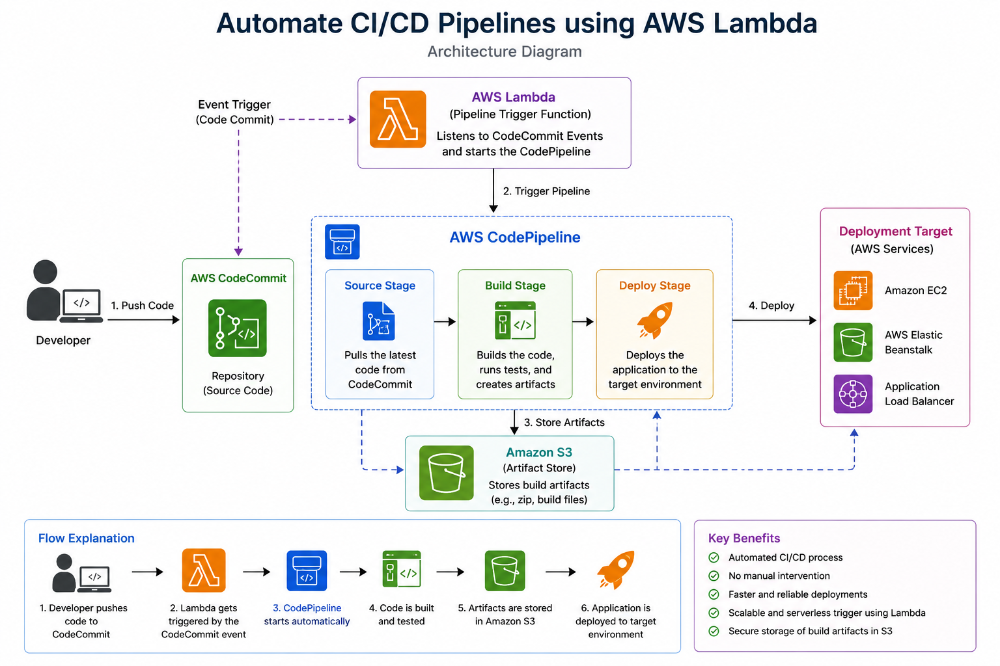
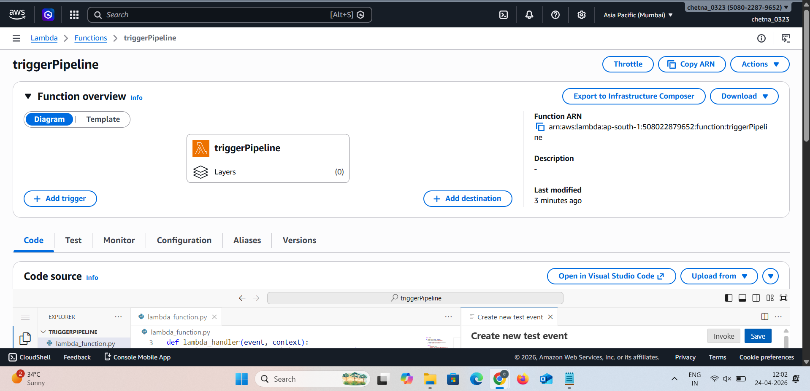
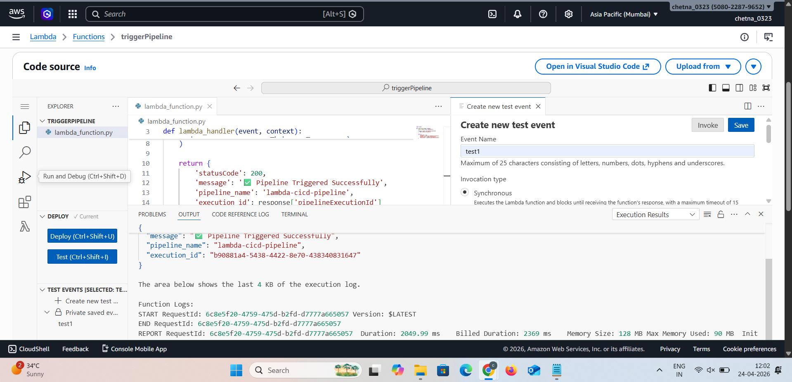
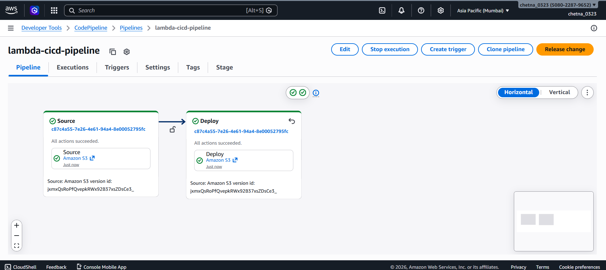
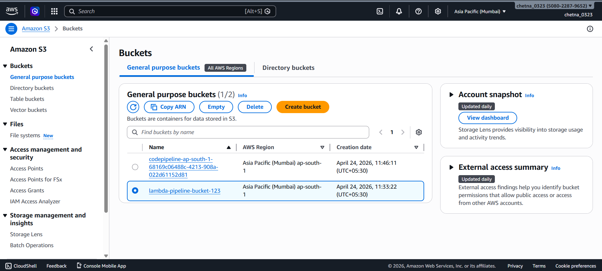

🚀 Automate CI/CD Pipeline using AWS Lambda


---

📌 Project Overview

This project demonstrates how to **automate CI/CD pipeline execution using AWS Lambda**.

Instead of manually triggering deployments, a Lambda function is used to **start the pipeline automatically**, enabling faster and event-driven deployments.

---

🎯 Purpose

* Automate deployment process
* Reduce manual effort
* Enable event-driven CI/CD
* Improve deployment speed

---

🧰 AWS Services Used

* AWS Lambda
* AWS CodePipeline
* Amazon S3

---

🏗️ Architecture Diagram



**Flow:**
Event / Trigger → Lambda → CodePipeline → S3 Deployment

---

⚙️ Lambda Function



The Lambda function is responsible for triggering the CI/CD pipeline using AWS SDK.

---

🧪 Lambda Execution Result



This shows successful execution of the Lambda function and confirms pipeline trigger.

---

🔄 CI/CD Pipeline



The pipeline automatically executes after being triggered by Lambda.

---

☁️ Amazon S3 Bucket



S3 is used to store application files and deployment artifacts.

---

🔥 Key Features

* Serverless CI/CD trigger using Lambda
* Fully automated deployment process
* Integration with AWS CodePipeline
* Event-driven architecture
* Faster and reliable deployments

---

📁 Project Structure

```
Lambda-CICD-Pipeline/
│── lambda_function.py
│── README.md
│── screenshots/
│    ├── lambda.png
│    ├── lambda-execution.png
│    ├── pipeline.png
│    ├── s3.png
│    ├── architecture.png
```

---

🧠 How It Works

1. Event triggers the Lambda function
2. Lambda calls AWS CodePipeline API
3. CodePipeline starts execution
4. Application is deployed automatically to S3

---

✅ Conclusion

This project shows how **AWS Lambda can be used to automate CI/CD pipelines**, making deployments faster, scalable, and fully automated without manual intervention.
